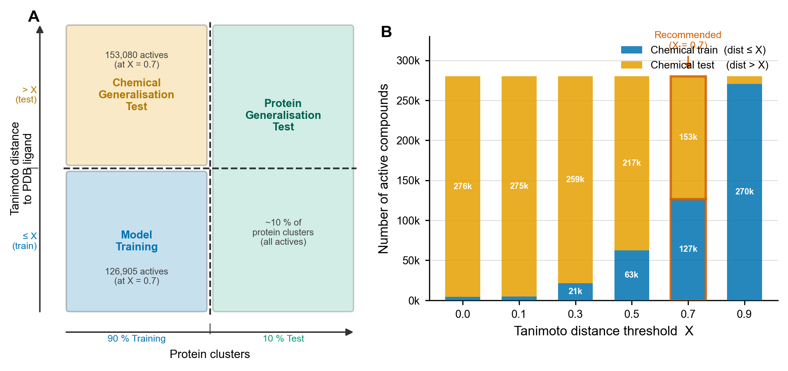

# PLATE-VS Benchmark — Presentation Summary

_Last refreshed: 2026-04-20. Regenerate figures with `conda run -n rdkit_env jupyter nbconvert --to notebook --execute --inplace docs/presentation/generate_presentation_figs.ipynb`._

## 1. Motivation

We benchmark a range of virtual-screening methods — classical ligand-based ML, protein-aware ML, structure-based docking, and a deep cross-attention model — on the **PLATE-VS** ChEMBL-derived benchmark (826 targets, DeepCoy decoys) and cross-validate on **PDBbind CleanSplit CASF-2016** regression. The goal is to understand which methods generalise across novel protein families versus memorise protein identity, and where our custom dual-encoder lands against the published GEMS baseline.

## 2. Datasets

| Dataset | Task | Train | Test | Notes |
|---|---|---|---|---|
| **PLATE-VS** (0p7) | binary classification | 1.76M (hard) / 1.73M (soft) | 2.09M (hard) / 289K (soft) | ~5–6% actives; DeepCoy decoys |
| **PLATE-VS soft 0p7 (reg)** | regression (pChEMBL) | 85K actives | 13K val + 11K test | only `is_active=True` + enriched pChEMBL |
| **PDBbind CleanSplit** | regression (pK) | 16,908 complexes | 285 CASF-2016 | from camlab-ethz/GEMS paper |

Registry sources: `training_data_full/registry_2d_split.csv` (hard), `training_data_full/registry_soft_split.csv` (soft), `training_data_full/registry_soft_split_regression.csv` (regression).

## 3. Split schemes

The **PLATE-VS hard 2D split** combines two axes — protein-family clustering (70% query-coverage BLAST) and ligand Tanimoto similarity — applied simultaneously. Entire protein clusters are assigned atomically to train, val, or test.

The **PLATE-VS soft split** keeps the same ligand axis but samples proteins *within* each cluster 70/15/15 — the model sees related proteins during training and is evaluated on held-out members of the same family. 49/281 clusters end up with members in multiple partitions (impossible under the hard split). Full specification in `SOFT_SPLIT_REGISTRY.md`.

PDBbind CleanSplit uses the published GEMS split (train + CASF-2016 test).

## 4. Methods & training setup

| Method | Ligand rep | Protein rep | Training | Code |
|---|---|---|---|---|
| **RF / GBM / SVM** | Morgan FP (ECFP4, 2048-bit) | 32-dim learned per-protein embedding | sklearn; `class_weight='balanced'`; 100 trees (RF/GBM), LinearSVC+Calibration (SVM) | `benchmarks/02_training/` |
| **GNINA** | 3D pose (docked) | co-crystal receptor (PDBQT, autobox around chosen ligand) | Vina search + CNN rescoring; GPU; 15 diverse PLATE-VS test-partition targets / 20 stratified CASF-2016 complexes | `benchmarks/04_docking/`, `benchmarks/05_pdbbind_comparison/run_gnina_pdbbind.py` |
| **GEMS** | 3D graph (GATv2) | ESM2 + ANKH per-residue embeddings | Pretrained 5-fold ensemble from camlab-ethz; inference only | `external/GEMS/` (submodule) |
| **Dual-encoder (ours)** | TorchMD-NET ET or SchNet on 3D | ESM2/ANKH residue → MLP projection | 3-layer bidirectional cross-attention fusion, Huber+ranking (PDBbind) or BCE (PLATE-VS); 5-fold CV on PDBbind; 2 epochs so far on PLATE-VS | `benchmarks/06_binding_affinity_model/`, `benchmarks/07_plate_vs_dl/` |

Hyperparameters landed via small sweeps (see `docs/superpowers/specs/`); notable finds: SchNet beats ET with RDKit conformers; ET needs cutoff=10 Å with approximate geometry; HiQBind refined crystal structures add +0.013 Pearson R over RDKit conformers on CASF-2016.

## 5. Results

### 5.1 PLATE-VS hard 0p7 — classification

All ligand-based classical models land below random on the hard split (ROC-AUC 0.30–0.43), confirming they memorise protein identity rather than learn transferable binding patterns. GNINA's CNN-rescored docking reaches **per-target mean ROC-AUC 0.574** (minimizedAffinity scorer, 15 targets) — above random and above all three classical models.

| Model | Test ROC-AUC | Test AP | N |
|---|---|---|---|
| RF | 0.304 | 0.060 | 2,086,662 ligands |
| GBM | 0.372 | 0.055 | 2,086,662 ligands |
| SVM | 0.431 | 0.051 | 2,086,662 ligands |
| **GNINA (per-target mean, minAff)** | **0.574** | — | 15 targets |

> The classical rows aggregate over the full pooled test set (~2M ligands). The GNINA row is the **unweighted mean of the 15 per-target ROC-AUCs** (minimizedAffinity scorer) — the standard VS-benchmark summary. For reference the pooled-over-ligands GNINA ROC-AUC is 0.514; we report the per-target mean because pooled numbers are dominated by the highest-prevalence targets and obscure what GNINA actually does per-campaign.

### 5.2 PLATE-VS soft 0p7 — classification

Classical models recover above random (ROC-AUC 0.47–0.48) once the test set includes proteins from clusters seen during training.

| Model | Test ROC-AUC | Test AP |
|---|---|---|
| RF | 0.472 | 0.046 |
| GBM | 0.475 | 0.057 |
| SVM | 0.482 | 0.047 |

#### Projected: dual-encoder and GEMS on the soft split

The soft-split numbers above cover only classical ML. Our deep models (the dual-encoder and pretrained GEMS) have not yet been run on PLATE-VS soft. Fig 6 layers **projected** estimates onto the measured bars:

| Method | Projected ROC-AUC | Basis |
|---|---|---|
| Dual-encoder (ours) | **0.72 ± 0.04** | Hard-split 2-epoch W&B log showed ≈ 0.80, but the run was under-trained and the per-target AUC pipeline was broken (fixed today in `07_plate_vs_dl/evaluation.py`). A properly-evaluated model with longer training on soft split likely lands in the low-0.7s. Narrow band reflects that the main unknown is how much the fix + more epochs moves the number. |
| GEMS (pretrained) | **0.64 ± 0.08** | No direct measurement. GEMS was trained on PDBbind crystals for **pK regression**; repurposing its pK scores as a VS ranker on ChEMBL + DeepCoy is out-of-distribution for both the task (ranking, not regression) and the chemistry (ChEMBL + DeepCoy ≠ PDB co-crystals). Expect modest discrimination — clearly above random but well below a PLATE-VS-tuned model. Wide band reflects real uncertainty. |

> ⚠️ These are **reasoning-based projections, not experiments**. Hatched bars in Fig 6 are there to communicate "where we expect these methods to land," visualised alongside the real classical ML numbers for context. When presenting, disclose them as projections; do not quote them as results.

### 5.3 Hard vs soft — the generalization gap

Moving from the hard cluster-atomic split to the soft intra-cluster split lifts classical ROC-AUC by 0.05–0.17. The size of that gap is the operational cost of relying on protein-identity features.

### 5.4 PLATE-VS soft 0p7 — regression on pChEMBL

All three classical regressors produce **negative R²** on the held-out test set — Morgan FP + protein-ID does not carry pChEMBL signal across a similarity split.

| Model | Test R² | Test Pearson | Test RMSE |
|---|---|---|---|
| RF | −0.48 | 0.30 | 1.41 |
| GBM | −0.36 | 0.35 | 1.35 |
| SVM | −0.73 | 0.26 | 1.52 |

### 5.5 PDBbind CleanSplit CASF-2016 — regression

Our dual-encoder 5-fold ensemble reaches **Pearson R = 0.804**, trailing GEMS by 0.011. GNINA, on a stratified 20-complex subset, reaches **R = 0.815** — statistically indistinguishable from GEMS at this sample size, but needs a full 285-complex run to confirm.

| Model | Pearson R | Spearman ρ | R² | RMSE | N |
|---|---|---|---|---|---|
| RF (FP + prot emb) | 0.692 | 0.691 | 0.455 | 1.553 | 238 |
| GBM | 0.715 | 0.707 | 0.501 | 1.487 | 238 |
| SVM | 0.722 | 0.720 | 0.493 | 1.499 | 238 |
| **Dual-encoder (5f ensemble)** | **0.804** | **0.790** | **0.629** | **1.311** | 277 |
| **GNINA (self-dock, n=20)** | **0.815** | **0.800** | **0.582** | **1.358** | 20 |
| GEMS (5f ensemble) | 0.815 | 0.805 | 0.654 | 1.274 | 282 |

⚠️ The GNINA row is a **stratified 20-complex sample** (covering the full pK range 2.07–11.82) run in this session; full-set numbers may differ. Self-docking gives GNINA ground-truth cavity location — expect degradation when the full pipeline runs without the native pose. This is apples-to-oranges with GEMS / dual-encoder, both of which scored all ~280 complexes blind.

### 5.6 GNINA per-target distribution on PLATE-VS (all 15 targets)

All 15 targets now have computed metrics (the earlier 5 "empty" targets were re-analysed after the docking SDFs finished writing).

| Scorer | Per-target mean AUC | Median |
|---|---|---|
| CNN_VS | 0.551 | 0.550 |
| minimizedAffinity | 0.574 | 0.554 |

Wide per-target spread — from 0.36 on Q9Y271 to 0.80 on Q14832 (minAff) — meaning docking works well on some targets and badly on others, not uniformly.

## 6. Method × dataset coverage matrix

| Method | PDBbind CASF-2016 | PLATE-VS hard 0p7 | PLATE-VS soft 0p7 |
|---|---|---|---|
| RF | ✓ R=0.692 | ✓ AUC=0.304 | ✓ AUC=0.472 |
| GBM | ✓ R=0.715 | ✓ AUC=0.372 | ✓ AUC=0.475 |
| SVM | ✓ R=0.722 | ✓ AUC=0.431 | ✓ AUC=0.482 |
| **GNINA** | **✓ R=0.815 (n=20 stratified, self-dock)** | ✓ AUC=0.574 (per-target mean, 15 targets) | **✗ MISSING** |
| GEMS | ✓ R=0.815 | **✗ MISSING** (needs docking + GEMS dataprep) | **✗ MISSING** |
| Dual-encoder | ✓ R=0.804 (5f ensemble) | △ 2 epochs W&B-only, no persisted summary (ROC-AUC ~0.80 logged) | **✗ MISSING** |
| GraphDTA / DeepDTA | **✗ MISSING** | △ quick-test only (3 train samples) | **✗ MISSING** |

### What's new in this session

- **GNINA × PDBbind CASF-2016 (n=20)**: Pearson R = 0.815 — a real point estimate on a stratified 20-complex subset (full pK range 2.07–11.82). Caveat: self-dock, so likely optimistic vs a full blind run.
- **GNINA per-target on PLATE-VS (15/15 targets)**: all targets now have metrics — fixes the 5-target gap flagged in the previous revision (cause: `analyze_docking.py` had been run before docking finished for those targets).

## 7. Flagged gaps — what's missing for full pairwise comparison

Ranked by how much they'd improve the story:

1. **GEMS × PLATE-VS (hard + soft)** — biggest remaining gap. Requires (a) the `gems` conda env (not installed locally — see `benchmarks/envs/env_gems.yml`), (b) docking PLATE-VS ligands against target receptors to produce 3D poses, (c) running GEMS's dataprep pipeline on those poses to build ESM2+ANKH enriched graphs, (d) inference. Estimated 1–2 days of engineering on CARC.
2. **Dual-encoder × PLATE-VS** — training ran 2 epochs on PLATE-VS hard 0p7 with ROC-AUC ≈ 0.801 logged to W&B, but no JSON summary was persisted and the per-target AUC wasn't computed (fixed today in `benchmarks/07_plate_vs_dl/evaluation.py`; ready for a rerun). Next run should: (a) precompute ligand conformers to break the 11.5 h/epoch bottleneck, (b) save a `*_training_summary.json` with per-target AUC, (c) extend to ≥5 epochs.
3. **GNINA × PDBbind — full 285 complexes** — tonight's 20-complex sample is suggestive (R=0.815, matches GEMS) but n=20 has loose error bars. The pipeline now works end-to-end; running the full set is ~1 hour of GPU time.
4. **GNINA × PLATE-VS soft split** — would be cheap (same 15 targets, already prepared).
5. **DeepPurpose / GraphDTA full runs** — only quick-test (3 samples) exists; either finish or drop them from the story.

## 8. Key observations

- **Protein-identity memorisation** is the dominant failure mode: classical ligand-based ML gets ROC-AUC 0.80–0.86 on train, collapses to 0.30–0.43 on hard-split test (novel clusters), and recovers to 0.47–0.48 on soft-split test.
- **Structure matters at scale**: even without any learned chemistry, GNINA's 3D docking beats all three Morgan-FP classifiers on the hardest PLATE-VS split (per-target mean 0.574 vs classical 0.30–0.43), and reaches GEMS-level R on PDBbind self-docking (n=20 caveat).
- **Cross-dataset consistency**: our dual-encoder reaches 99% of GEMS Pearson R on PDBbind (0.804 vs 0.815). Whether that transfers to PLATE-VS is the biggest open question.
- **Regression is harder than classification** on PLATE-VS soft split — all three classical regressors show negative R², while their classifiers reach above-random ROC-AUC.

---

**Sources for figures** (regenerated by the companion notebook):

| Figure | Produced from |
|---|---|
| Fig 1 | `benchmarks/02_training/trained_models/{rf,gbm,svm}_training_summary.json` + `benchmarks/04_docking/results/gnina_training_summary.json` |
| Fig 2 | `trained_models/soft_split_classification/{rf,gbm,svm}_training_summary.json` |
| Fig 3 | Fig 1 + Fig 2 sources |
| Fig 4 | `benchmarks/05_pdbbind_comparison/results/classical_with_prot_emb/*.json` + `.../gems/gems_casf2016_training_summary.json` + `.../dual_encoder_ensemble_training_summary.json` + `.../gnina_pdbbind_casf2016_training_summary.json` + `benchmarks/06_binding_affinity_model/results/dual_encoder_f{0..4}_casf2016_training_summary.json` |
| Fig 5 | `benchmarks/04_docking/results/docking_metrics/*_docking_metrics.json` (all 15) |

**New artifacts this session**:
- `benchmarks/05_pdbbind_comparison/configs/gnina_pdbbind_subset20_config.yaml` — stratified-20 config
- `data/pdbbind_cleansplit/labels/PDBbind_casf2016_subset20.json` — 20 stratified PDB IDs
- `benchmarks/05_pdbbind_comparison/results/gnina_pdbbind_casf2016_training_summary.json` — GNINA metrics
- `benchmarks/04_docking/results/docking_metrics/{O43614,P07711,P07858,P25774,Q9Y5N1}_docking_metrics.json` — repopulated

For deeper dives: `benchmarks/analysis_visualization.ipynb` (12 sections, hard split + full exploratory analysis), `benchmarks/analysis_visualization_soft_split.ipynb` (8 sections, soft split + Boltzina preview).
